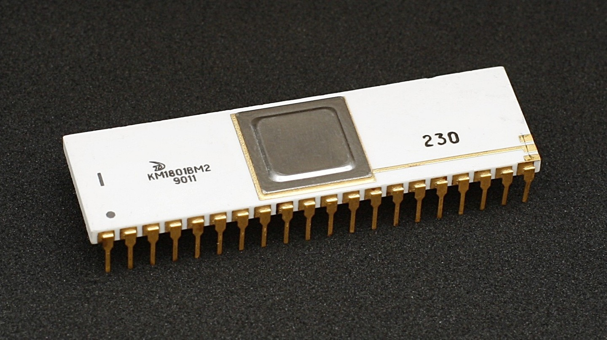

# КМ1801ВМ2 / KM1801VM2 — Documentation and Schematics

This repository collects documentation, schematics, and scanned images for the КМ1801ВМ2 (KM1801VM2).

## Repository Structure
- `Documentation/` — main documentation and HTML viewer.
  - `Documentation/translation-viewer.html` — open in a web browser to view translated pages.
- `Documentation/КМ1801ВМ2 - Schematic Collection/` — schematic scan collection.
- `Documentation/КМ1801ВМ2 - Technical Description - Part 1/` — technical descriptions (Part 1).
- `Documentation/КМ1801ВМ2 - Technical Description - Part 2/` — technical descriptions (Part 2).
- `Images/` — images and figures.

## Translation Viewer
The translation viewer is a tool made by Claude Code to view and create translation.
1. Open `Documentation/translation-viewer.html` in your browser
2. Click `📁 Open Image Folder` and open of the documentation folders, if a json file is present it will be loaded with the translation.

## Credits & Sources

- Scans come from SuperMax on the maxiol forum
    - https://forum.maxiol.com/index.php?showtopic=4599
    - http://pdp-11.ru/mybk/pdp11/

- Additional resources
    - http://www.nedopc.org/forum/viewtopic.php?t=20572&sid=48af47f8728fc03e16203680a126e6d5
    - https://dplm2008.narod.ru/str/komplects/k1801/km1801vm2.html

- Translation via online AI services + manual edit
    - https://openl.io/translate/image